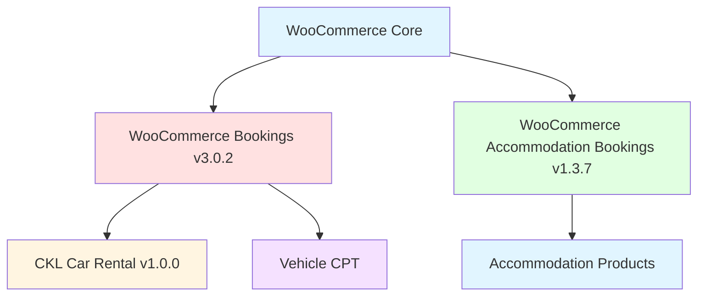
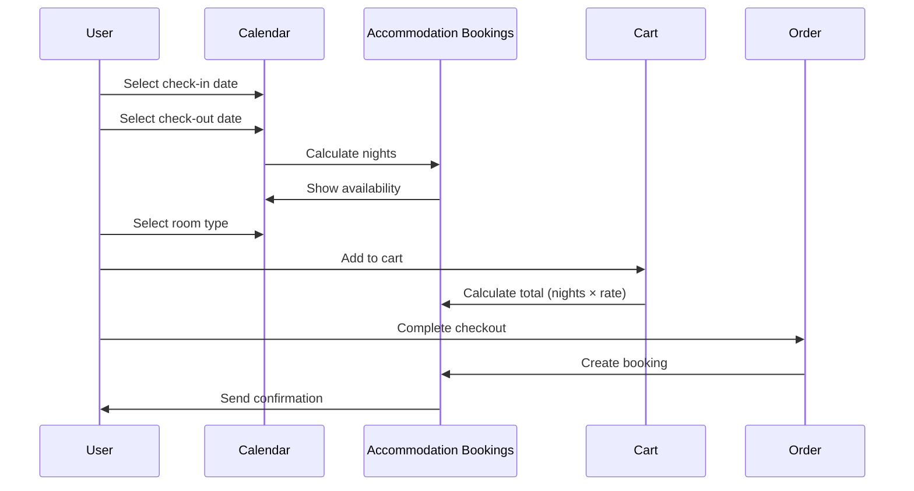
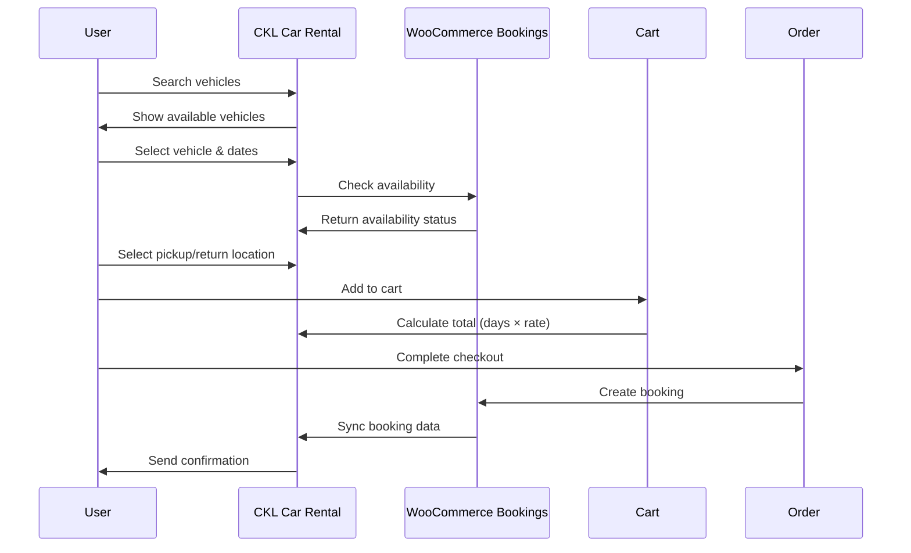
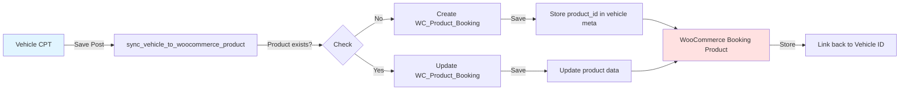
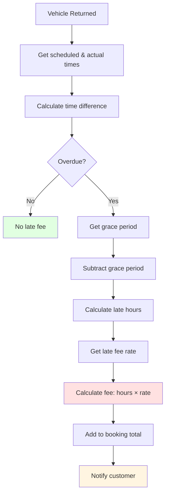
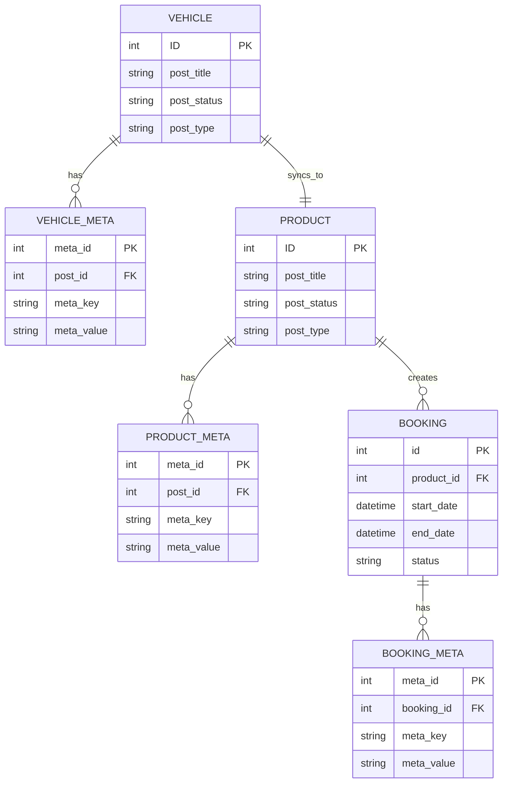

# CKL Booking System - Data Flow Diagrams

## Mermaid Diagrams

### System Architecture Overview



### Accommodation Booking Flow



### Car Rental Booking Flow



### Vehicle CPT to WooCommerce Sync



### Late Fee Calculation Flow



### Database Schema Relationships



---

## ASCII Diagrams

### Class Hierarchy

```
WC_Product
    │
    ├── WC_Product_Booking
    │       │
    │       ├── WC_Product_Accmodation_Booking
    │       │
    │       └── [Custom Vehicle Booking via CKL Car Rental]
    │
    └── WC_Product_Simple
            └── [Other standard products]
```

### File Structure

```
/web/app/
├── plugins/
│   ├── woocommerce/
│   │   └── [WooCommerce core files]
│   │
│   ├── woocommerce-bookings/
│   │   ├── woocommerce-bookings.php
│   │   ├── includes/
│   │   │   ├── data-objects/
│   │   │   │   ├── class-wc-product-booking.php
│   │   │   │   └── class-wc-booking.php
│   │   │   ├── class-wc-booking-cart-manager.php
│   │   │   ├── class-wc-booking-order-manager.php
│   │   │   └── ...
│   │   └── templates/
│   │
│   ├── woocommerce-accommodation-bookings/
│   │   ├── woocommerce-accommodation-bookings.php
│   │   ├── includes/
│   │   │   ├── class-wc-product-accommodation-booking.php
│   │   │   ├── class-wc-accommodation-booking-cart-manager.php
│   │   │   ├── class-wc-accommodation-booking-order-manager.php
│   │   │   └── admin/
│   │   └── templates/
│   │
│   └── ckl-car-rental/
│       ├── ckl-car-rental.php
│       ├── includes/
│       │   ├── class-booking-manager.php
│       │   ├── class-late-fees.php
│       │   ├── class-location-system.php
│       │   └── ...
│       └── assets/
│
└── mu-plugins/
    └── custom-post-types.php
        ├── Vehicle CPT registration
        ├── Vehicle meta boxes
        └── WooCommerce sync logic
```

---

## Process Flowcharts

### New Vehicle Creation Process

```
┌─────────────────┐
│ Admin creates   │
│ new Vehicle CPT │
└────────┬────────┘
         │
         ▼
┌─────────────────┐
│ Fill vehicle    │
│ details form    │
│ (type, price,   │
│ capacity, etc.) │
└────────┬────────┘
         │
         ▼
┌─────────────────┐
│ Save vehicle    │
│ post            │
└────────┬────────┘
         │
         ▼
┌─────────────────────────┐
│ sync_vehicle_to_        │
│ woocommerce_product()   │
└────────┬────────────────┘
         │
         ▼
┌─────────────────────────────┐
│ Create WC_Product_Booking   │
│ with vehicle data           │
└────────┬────────────────────┘
         │
         ▼
┌─────────────────────────┐
│ Store product_id in     │
│ vehicle meta            │
└────────┬────────────────┘
         │
         ▼
┌─────────────────┐
│ Vehicle ready   │
│ for booking     │
└─────────────────┘
```

### Booking Creation Process

```
┌─────────────────┐
│ Customer        │
│ searches for    │
│ vehicle/room    │
└────────┬────────┘
         │
         ▼
┌─────────────────┐
│ System checks   │
│ availability    │
└────────┬────────┘
         │
         ▼
┌─────────────────┐
│ Customer        │
│ selects dates   │
│ & options       │
└────────┬────────┘
         │
         ▼
┌─────────────────┐
│ Add to cart     │
│ with calculated │
│ pricing         │
└────────┬────────┘
         │
         ▼
┌─────────────────┐
│ Customer        │
│ completes       │
│ checkout        │
└────────┬────────┘
         │
         ▼
┌─────────────────┐
│ Order created   │
│ in WooCommerce  │
└────────┬────────┘
         │
         ▼
┌─────────────────┐
│ Booking created │
│ in WC_Bookings  │
└────────┬────────┘
         │
         ▼
┌─────────────────┐
│ Confirmation   │
│ sent to         │
│ customer        │
└─────────────────┘
```

---

## Pricing Calculation Examples

### Accommodation Example

```
Scenario: 3-night stay in a villa

Input:
- Check-in: 2026-03-01
- Check-out: 2026-03-04
- Base Rate: RM 300/night
- Guests: 4 adults

Calculation:
Nights = (2026-03-04) - (2026-03-01) = 3 nights
Base Total = 3 × RM 300 = RM 900
Person Type Fees = (4 - 2) × RM 50 = RM 100

Total = RM 900 + RM 100 = RM 1,000
```

### Car Rental Example

```
Scenario: 2-day car rental with 3-hour late return

Input:
- Pickup: 2026-03-01 10:00
- Return: 2026-03-03 15:00 (scheduled: 2026-03-03 10:00)
- Daily Rate: RM 150/day
- Late Fee Rate: RM 20/hour
- Grace Period: 30 minutes

Calculation:
Days = ceil((2026-03-03 10:00 - 2026-03-01 10:00) / 24 hours) = 2 days
Base Total = 2 × RM 150 = RM 300

Late Hours = 15:00 - 10:00 - 0:30 = 4.5 hours → 5 hours (rounded up)
Late Fee = 5 × RM 20 = RM 100

Total = RM 300 + RM 100 = RM 400
```

---

## State Diagrams

### Booking Status Flow

```
┌─────────┐
│ Pending │
└────┬────┘
     │
     ▼
┌─────────┐      ┌──────────┐
│ Confirmed│─────>│ Complete │
└────┬────┘      └──────────┘
     │
     ▼
┌─────────┐      ┌──────────┐
│ Cancelled│     │ Refunded │
└─────────┘      └──────────┘
```

### Vehicle Availability State

```
┌──────────┐
│ Available│
└────┬─────┘
     │
     ▼ (when booked)
┌──────────┐
│ Booked   │
└────┬─────┘
     │
     ├─────────────┐
     │             │
     ▼ (return)    ▼ (maintenance)
┌──────────┐  ┌──────────┐
│ Available│  │ Blocked  │
└──────────┘  └────┬─────┘
                   │
                   ▼ (complete)
              ┌──────────┐
              │ Available │
              └──────────┘
```

---

## Component Interactions

### Frontend Components

```
┌─────────────────────────────────────────────────────────┐
│                       Frontend                          │
├─────────────────────────────────────────────────────────┤
│                                                           │
│  ┌─────────────┐  ┌─────────────┐  ┌─────────────┐   │
│  │   Hero      │  │   Search    │  │   Results   │   │
│  │   Search    │  │   Filters   │  │   Grid      │   │
│  └─────────────┘  └─────────────┘  └─────────────┘   │
│                                                           │
│  ┌─────────────────────────────────────────────────┐   │
│  │              Booking Form                        │   │
│  │  ┌─────────┐  ┌─────────┐  ┌─────────────────┐  │   │
│  │  │ Date    │  │ Guest   │  │   Location      │  │   │
│  │  │ Picker  │  │ Count   │  │   Selector      │  │   │
│  │  └─────────┘  └─────────┘  └─────────────────┘  │   │
│  └─────────────────────────────────────────────────┘   │
│                                                           │
│  ┌─────────────────────────────────────────────────┐   │
│  │              Cart & Checkout                     │   │
│  └─────────────────────────────────────────────────┘   │
└─────────────────────────────────────────────────────────┘
         │                    │                    │
         │                    │                    │
         ▼                    ▼                    ▼
    ┌─────────┐         ┌─────────┐         ┌─────────┐
    │   API   │         │   API   │         │   API   │
    └─────────┘         └─────────┘         └─────────┘
```

### Backend Components

```
┌─────────────────────────────────────────────────────────┐
│                       Backend                           │
├─────────────────────────────────────────────────────────┤
│                                                           │
│  ┌─────────────┐  ┌─────────────┐  ┌─────────────┐   │
│  │   Booking   │  │   Pricing   │  │ Availability│   │
│  │  Manager    │  │   Engine    │  │   Manager   │   │
│  └─────────────┘  └─────────────┘  └─────────────┘   │
│                                                           │
│  ┌─────────────┐  ┌─────────────┐  ┌─────────────┐   │
│  │    Late     │  │  Location   │  │   Calendar  │   │
│  │    Fees     │  │   System    │  │     Sync    │   │
│  └─────────────┘  └─────────────┘  └─────────────┘   │
│                                                           │
│  ┌─────────────┐  ┌─────────────┐  ┌─────────────┐   │
│  │   Reviews   │  │  Analytics  │  │   Dynamic   │   │
│  │   System    │  │             │  │   Pricing   │   │
│  └─────────────┘  └─────────────┘  └─────────────┘   │
│                                                           │
└─────────────────────────────────────────────────────────┘
         │                    │                    │
         │                    │                    │
         ▼                    ▼                    ▼
    ┌─────────┐         ┌─────────┐         ┌─────────┐
    │   DB    │         │   DB    │         │   DB    │
    └─────────┘         └─────────┘         └─────────┘
```

---

## API Request/Response Examples

### Check Vehicle Availability

**Request:**
```
GET /wp-json/ckl/v1/vehicles/availability
?vehicle_id=123
&start_date=2026-03-01
&end_date=2026-03-03
&location=airport
```

**Response:**
```json
{
  "available": true,
  "vehicle": {
    "id": 123,
    "name": "Toyota Vios",
    "type": "sedan",
    "capacity": 5,
    "price_per_day": 150
  },
  "pricing": {
    "days": 2,
    "base_rate": 150,
    "total": 300,
    "currency": "MYR"
  },
  "availability": {
    "available_units": 3
  }
}
```

### Create Booking

**Request:**
```
POST /wp-json/wc-bookings/v1/bookings
{
  "product_id": 456,
  "start_date": "2026-03-01T10:00:00",
  "end_date": "2026-03-03T10:00:00",
  "persons": 2
}
```

**Response:**
```json
{
  "id": 789,
  "product_id": 456,
  "start_date": "2026-03-01T10:00:00",
  "end_date": "2026-03-03T10:00:00",
  "status": "confirmed",
  "order_id": 101,
  "customer_id": 5
}
```

---

## Error Handling

### Common Error States

```
┌─────────────────────────────────────────────────────────┐
│                    Error States                         │
├─────────────────────────────────────────────────────────┤
│                                                           │
│  ┌─────────────────────────────────────────────────┐   │
│  │ Availability Errors                              │   │
│  │  - No vehicles available for selected dates      │   │
│  │  - All units booked                              │   │
│  │  - Location has no available vehicles            │   │
│  └─────────────────────────────────────────────────┘   │
│                                                           │
│  ┌─────────────────────────────────────────────────┐   │
│  │ Validation Errors                                │   │
│  │  - Invalid date range (return before pickup)     │   │
│  │  - Minimum stay not met                          │   │
│  │  - Maximum stay exceeded                         │   │
│  │  - Invalid location combination                  │   │
│  └─────────────────────────────────────────────────┘   │
│                                                           │
│  ┌─────────────────────────────────────────────────┐   │
│  │ Payment Errors                                   │   │
│  │  - Payment gateway timeout                       │   │
│  │  - Insufficient funds                            │   │
│  │  - Payment declined                              │   │
│  └─────────────────────────────────────────────────┘   │
│                                                           │
└─────────────────────────────────────────────────────────┘
```

---

## Security Considerations

### Access Control

```
┌─────────────────────────────────────────────────────────┐
│                    Access Control                       │
├─────────────────────────────────────────────────────────┤
│                                                           │
│  Role              │  Bookings  │  Vehicles  │  Settings│
│  ─────────────────┼───────────┼────────────┼──────────│
│  Administrator     │  Full     │  Full      │  Full    │
│  Shop Manager      │  Full     │  Full      │  Limited │
│  Customer          │  Own only │  View only │  None    │
│  Guest             │  None     │  View only │  None    │
│                                                           │
└─────────────────────────────────────────────────────────┘
```

### Data Validation

All booking data must be validated:
- Date ranges must be valid
- Pickup must be before return
- Duration must be within min/max limits
- Location combinations must be valid
- Payment amounts must match calculated totals

---

This diagram file is designed to be used with Mermaid-compatible tools like GitHub, VS Code, or online Mermaid editors.
